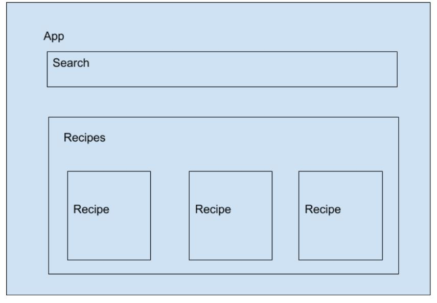
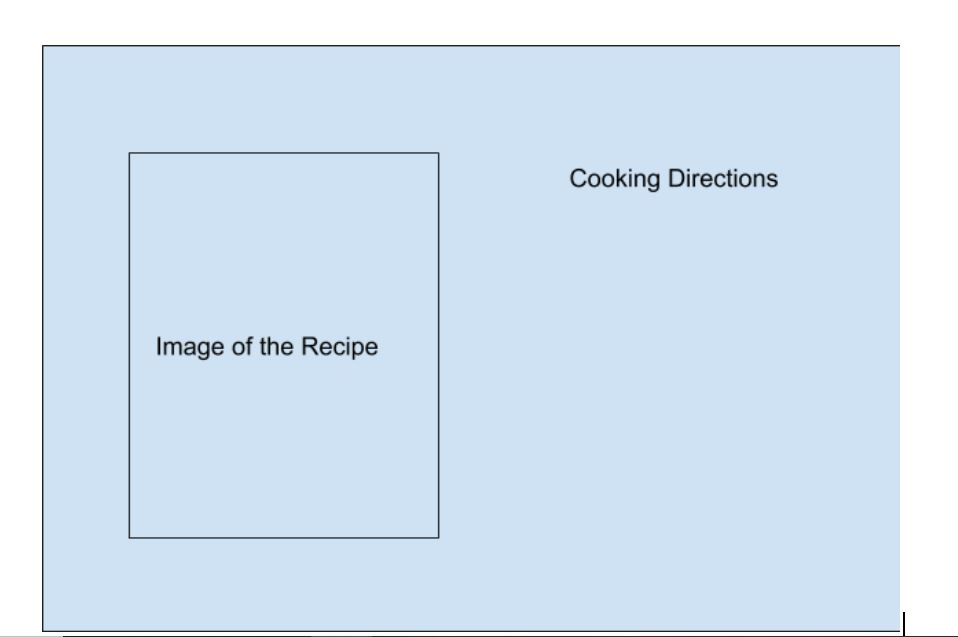
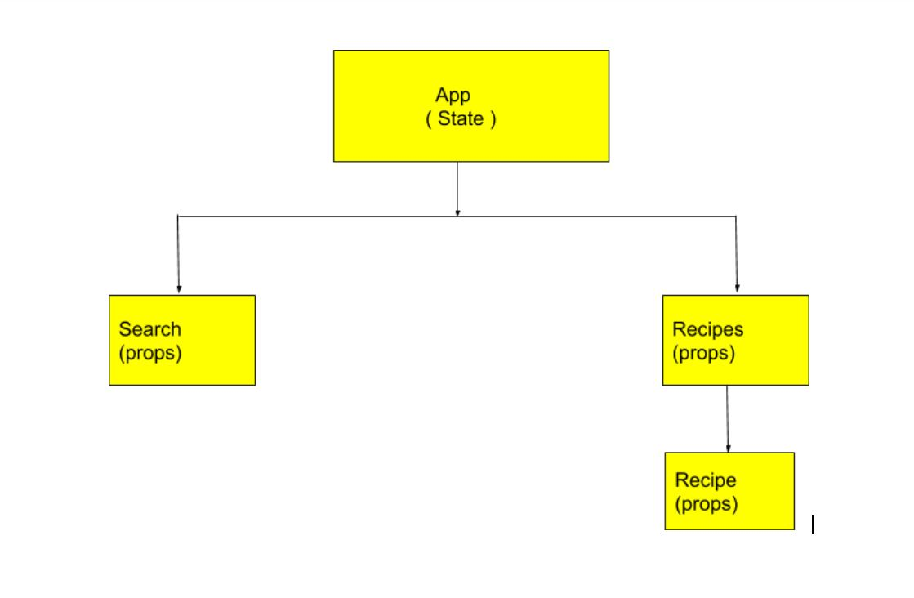

## Project Proposal Worksheet


## Project Description

My app is called Yummy-Town. It's a recipe app for people who wants to learn cooking and the people who are passionate about learning new recipes. Users can search recipes by recipe names and they could see the instructions of cooking.


## Wireframes

### Home


### Show



### MVP User Stories

- As a user, I want to search a recipe in the search box by typing recipe name.
- As a user, I would like to click on an individual recipe so I could see the cooking directions of the recipe.

### Post MVP Stretch Goals

- As a user, I would like to add links to the videos so people could learn cooking by watching recipe video.


## API
[The Meal DB API Documentation](https://www.themealdb.com/api.php)


### Search meal by name Response
```javascript
{
  meals: [
            {
            idMeal: "52795",
            strMeal: "Chicken Handi",
            strDrinkAlternate: null,
            strCategory: "Chicken",
            strArea: "Indian",
            strInstructions: "Take a large pot or wok, big enough to cook all the chicken, and heat the oil in it. Once the oil is hot, add sliced onion and fry them until deep golden brown. Then take them out on a plate and set aside. To the same pot, add the chopped garlic and sauté for a minute. Then add the chopped tomatoes and cook until tomatoes turn soft. This would take about 5 minutes. Then return the fried onion to the pot and stir. Add ginger paste and sauté well. Now add the cumin seeds, half of the coriander seeds and chopped green chillies. Give them a quick stir. Next goes in the spices – turmeric powder and red chilli powder. Sauté the spices well for couple of minutes. Add the chicken pieces to the wok, season it with salt to taste and cook the chicken covered on medium-low heat until the chicken is almost cooked through. This would take about 15 minutes. Slowly sautéing the chicken will enhance the flavor, so do not expedite this step by putting it on high heat. When the oil separates from the spices, add the beaten yogurt keeping the heat on lowest so that the yogurt doesn’t split. Sprinkle the remaining coriander seeds and add half of the dried fenugreek leaves. Mix well. Finally add the cream and give a final mix to combine everything well. Sprinkle the remaining kasuri methi and garam masala and serve the chicken handi hot with naan or rotis. Enjoy!",
            strMealThumb: "https://www.themealdb.com/images/media/meals/wyxwsp1486979827.jpg",
            strTags: null,
            strYoutube: "https://www.youtube.com/watch?v=IO0issT0Rmc",
            strIngredient1: "Chicken",
            strIngredient2: "Onion",
            strIngredient3: "Tomatoes",
            strIngredient4: "Garlic",
            strIngredient5: "Ginger paste",
            strIngredient6: "Vegetable oil",
            strIngredient7: "Cumin seeds",
            strIngredient8: "Coriander seeds",
            strIngredient9: "Turmeric powder",
            strIngredient10: "Chilli powder",
            strIngredient11: "Green chilli",
            strIngredient12: "Yogurt",
            strIngredient13: "Cream",
            strIngredient14: "fenugreek",
            strIngredient15: "Garam masala",
            strIngredient16: "Salt",
            strIngredient17: "",
            strIngredient18: "",
            strIngredient19: "",
            strIngredient20: "",
            strMeasure1: "1.2 kg",
            strMeasure2: "5 thinly sliced",
            strMeasure3: "2 finely chopped",
            strMeasure4: "8 cloves chopped",
            strMeasure5: "1 tbsp",
            strMeasure6: "¼ cup",
            strMeasure7: "2 tsp",
            strMeasure8: "3 tsp",
            strMeasure9: "1 tsp",
            strMeasure10: "1 tsp",
            strMeasure11: "2",
            strMeasure12: "1 cup",
            strMeasure13: "¾ cup",
            strMeasure14: "3 tsp Dried",
            strMeasure15: "1 tsp",
            strMeasure16: "To taste",
            strMeasure17: "",
            strMeasure18: "",
            strMeasure19: "",
            strMeasure20: "",
            strSource: "",
            dateModified: null
    }
  ]
}
```


## Component Hierarchy




